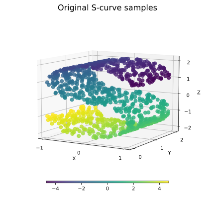
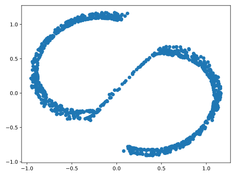
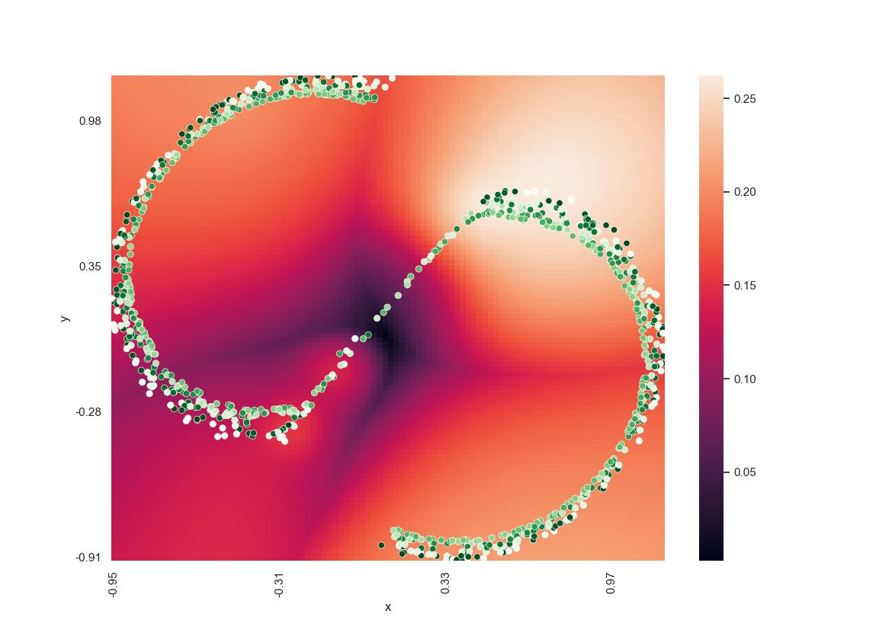
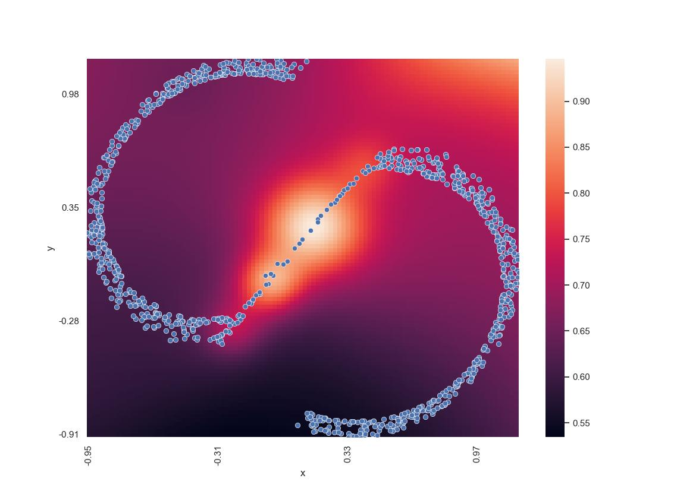
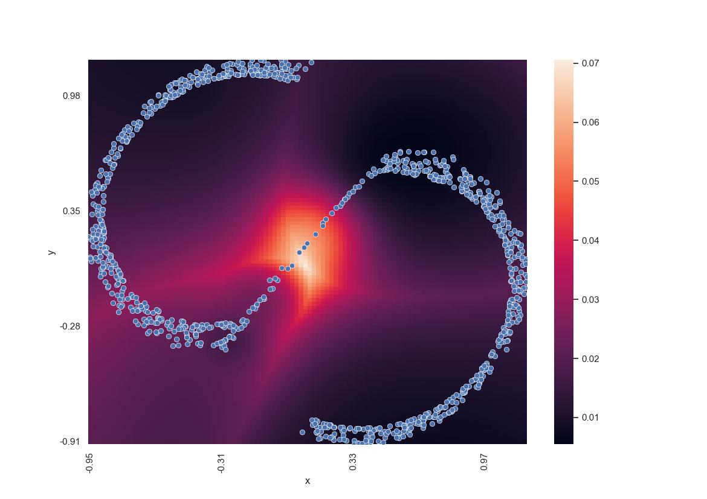

# Interpretable Dimension Reduction
This is a try to make a non-linear dimension reduction that is easier to interpret.

## Basic theory
n number of gaussian functions are created. The centers($\mu$) are sampled among the data points. Each gaussian function is assigned a linear transformation, T: ℝ<sup>d<sub>1</sub></sup> → ℝ<sup>d<sub>2</sub></sup>, where d<sub>2</sub><d<sub>1</sub>. The gaussian functions are weights for each linear transformation.
During optimization are $\sigma$ and T optimized, so that the difference of the distances between data points in the reduced space and the original space is minimized. $\mu$ is not optimized by default, but can be. A data point is transformed by calculating the weights, given the guassian functions with the data point as input. Then a transformation matrix is created by summing all T using these weights. Then is this linear transformation applied to the point.

## Installation
```
pip install tensorflow
```
Then put DimReduction.py in the same folder as where you are executing your code.

## Basic usage

```python
from DimReduction import DimReduction

number_of_gaussians = 100
dr = DimReduction(number_of_gaussians)
# data has shape [number of data points, dimension]
x = dr.fit_transform(data)
#or
dr.fit(data)
x = dr.transform(data) #Or possibly another dataset
```

## Example with [S-curve](https://scikit-learn.org/stable/auto_examples/manifold/plot_compare_methods.html)


<br>
Let's reduce the data above to two dimensions.
<br>

```python
from DimReduction import DimReduction
from sklearn import datasets
import matplotlib.pyplot as plt

n_samples = 1000
S_points, S_color = datasets.make_s_curve(n_samples, random_state=0)

dr = DimReduction(100) #(gaussian_points=121, neighbours=None, dim2=2, train_gaussian_points=False)
#fit_transform(self, vectors, learning_rate=0.01, max_epochs=1000, patience=None)
x = dr.fit_transform(S_points,max_epochs=2000) 

plt.scatter(x[:,0], x[:,1])
```
<br>

<br>
This is the output. In this toy problem we know the real shape of the data. So for this problem we know the reduction has not preserved the distances without error. Running:

```python
dr.get_reconstruction_error(S_points)
```


0.44566297789736753
<br><br>
Confirms this. We also know for this case that it is the Y-axis dimension that is shrinked. Running:
<br>

```python
dr.get_dimension_influence()
```


array([[0.3997428 ],[0.25298584],[0.34727138]], dtype=float32)
<br><br>
Supports this. Now equipped with this knowledge, we can plot the reduction with the original Y-axis as color. As one can do with all dimension reduction techniques. Let's also add the influence of the Y-axis in the background. This is done by calculating the transformation over a mesh:
<br>

 ```python
import pandas as pd
import numpy as np
import seaborn as sns
import matplotlib.pylab as plt

def plot_heatmap(df):
    
    sns.set(rc={'figure.figsize':(11.7,8.27)})
    ax = sns.heatmap(df)
    ax.invert_yaxis()

    ax.set_yticklabels(["{0:.2f}".format(float(l.get_text())) for (i,l) in enumerate(ax.yaxis.get_ticklabels())])
    ax.set_xticklabels(["{0:.2f}".format(float(l.get_text())) for (i,l) in enumerate(ax.xaxis.get_ticklabels())])
    [l.set_visible(False) for (i,l) in enumerate(ax.xaxis.get_ticklabels()) if i % 10 != 0]
    [l.set_visible(False) for (i,l) in enumerate(ax.yaxis.get_ticklabels()) if i % 10 != 0]
    
def create_df(w, positions):
    df = pd.DataFrame()
    df['w'] = w
    df['x']=positions[:,0]
    df['y']=positions[:,1]
    df=df.pivot(values='w',index='y',columns='x')
    return df
    
num = 100 #mesh size
min_x = np.min(x[:,0])
min_y = np.min(x[:,1])
max_x = np.max(x[:,0])
max_y = np.max(x[:,1])
ranges = [[min_x,max_x],[min_y,max_y]]

w, positions=dr.get_influence_mesh([num,num], ranges)

df = create_df(w[:,1], positions)

plot_heatmap(df)
sns.scatterplot(x=num * (x[:,0] - min_x) / (max_x - min_x), y=num*(x[:,1] - min_y) / (max_y - min_y), c=S_points[:,1], cmap='Greens')
plt.show()
```

<br>

<br>
From above graph it is evident that y-axis has basically no influence in the center, while it has almost equal influence in the upper right corner.
<br><br>
It is interesting to know to what degree the space is being contracted and where it is expanding. To do this we calculate the norm of the transformation matrix over the mesh.

```python


num = 100 #mesh size
min_x = np.min(x[:,0])
min_y = np.min(x[:,1])
max_x = np.max(x[:,0])
max_y = np.max(x[:,1])
ranges = [[min_x,max_x],[min_y,max_y]]

w, positions = dr.get_matrix_norm_mesh([num,num], ranges)

df = create_df(w, positions)

plot_heatmap(df)
sns.scatterplot(x=num * (x[:,0] - min_x) / (max_x - min_x), y=num*(x[:,1] - min_y) / (max_y - min_y))
plt.show()
```

<br>

<br>
Here we see that the space is contracted slightly at the middle of the S while contracted a lot at the ends. This is important if one wants to compare distance between different parts of the reduced space.
<br><br>
It can also be interesting to know how the skewness of the transformation differ. That is, where are the original dimensions given equal importance, and where they are not.
<br>

 ```python


num = 100 #mesh size
min_x=np.min(x[:,0])
min_y=np.min(x[:,1])
max_x=np.max(x[:,0])
max_y=np.max(x[:,1])
ranges = [[min_x,max_x],[min_y,max_y]]

w, positions=dr.get_component_variation_mesh([num,num], ranges)

df = create_df(w, positions)

plot_heatmap(df)
sns.scatterplot(x=num * (x[:,0] - min_x) / (max_x - min_x), y=num*(x[:,1] - min_y) / (max_y - min_y))
plt.show()
```
<br>

<br>
Here we see that the transformation is very skewed at the center and less skewed otherwise. This is since the original Y-axis is given more importance here. 

## Contact
Erik Bergh, er.bergh@gmail.com
